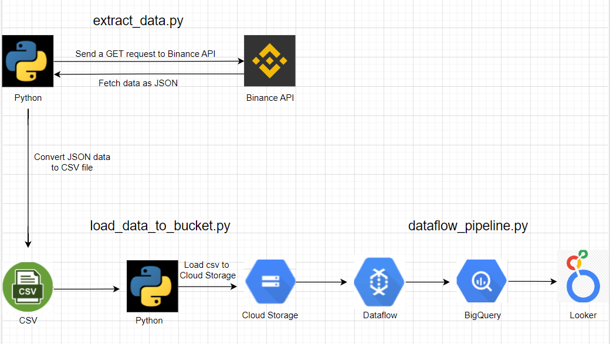
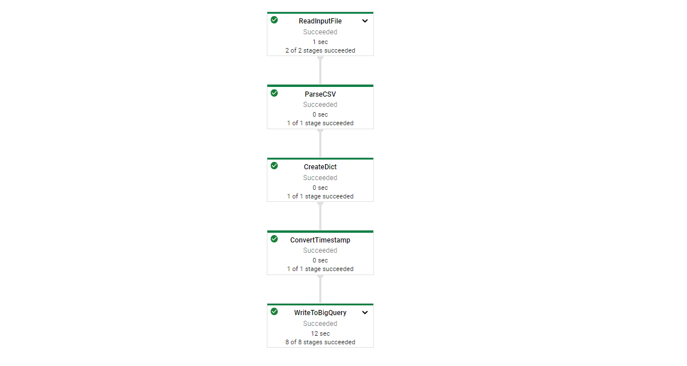
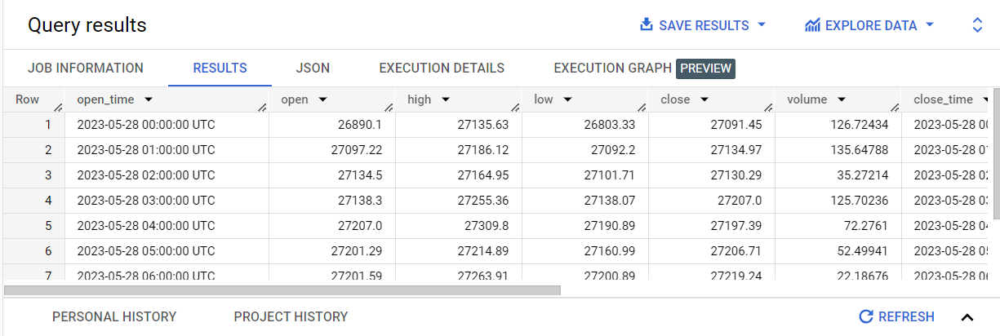
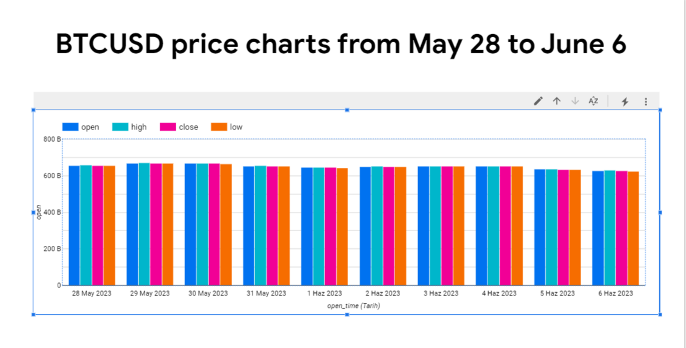

# Pipeline Flowchart

<h1>How the Pipeline Works</h1>

A data pipeline has been designed using the Binance API and Google Cloud Platform. In the extract_data.py script, hourly data for the BTCUSD coin between May 28, 2023, and June 8, 2023, was extracted using the Binance API. Subsequently, the extracted data was converted to CSV format.

A bucket was created using Google Cloud SDK Shell. IAM was used to set up the necessary permissions for the bucket. Then, the load_data_to_bucket.py script was used to upload the CSV data to the Cloud Storage Bucket.

In the dataflow_pipeline.py script, a workflow was created using Apache Beam and the necessary settings were made to run this workflow on Dataflow. The purpose of this workflow is to read the CSV file in Cloud Storage and write the data to BigQuery after making the necessary transformations. Using the ParDo class, open_time and close_time data were converted from epoch time to real time. Then the data flow steps were created. First, the CSV file was read from the Cloud Storage Bucket. Then the CSV was parsed and the necessary transformations were made. Finally, the data was written to the BigQuery table.

<h1>Dataflow Diagram</h1>

<h1>Data written into BigQuery</h1>

<h1>Data Visualization with Looker</h1>
